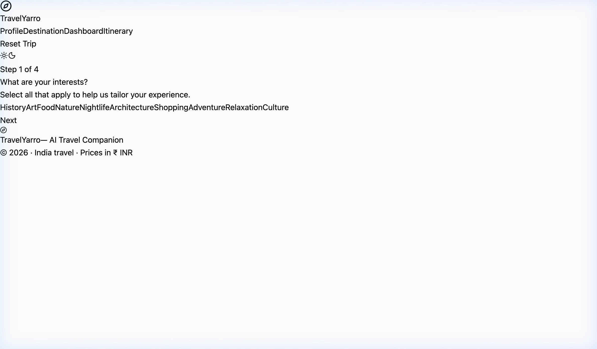
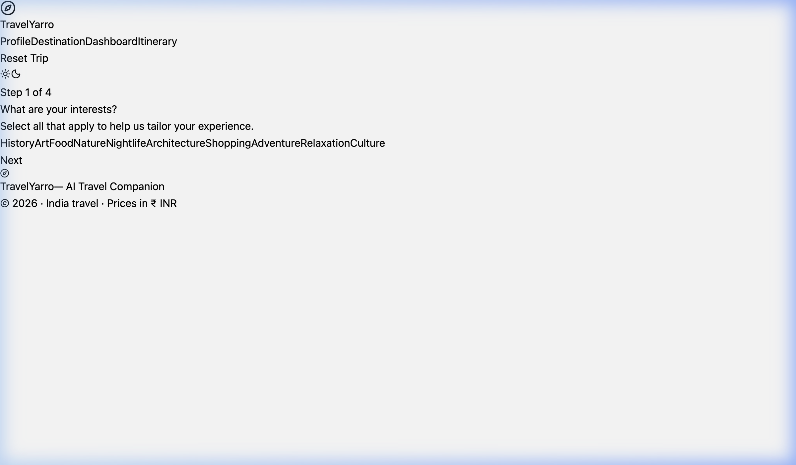
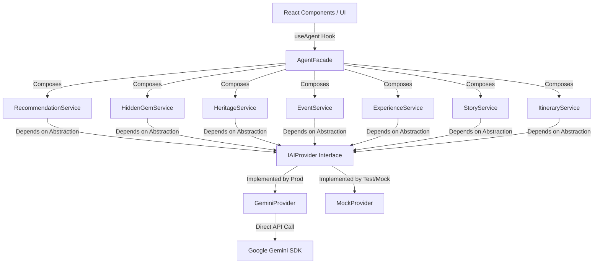
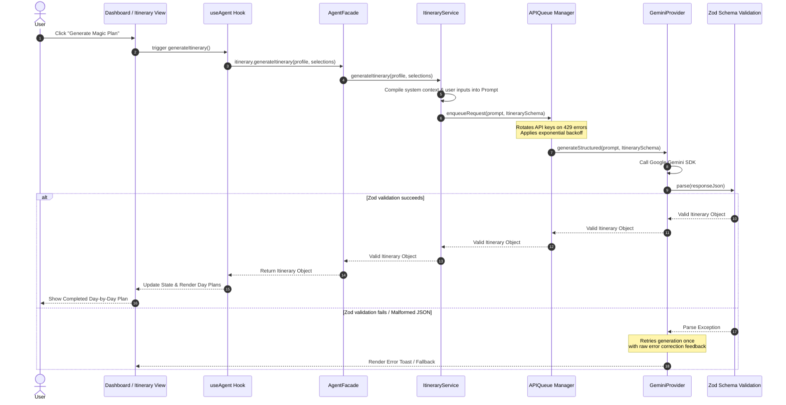

# TravelYarro — AI Travel Companion
*Your personal AI-powered travel curator for discovering hidden gems, authentic experiences, and rich cultural heritage in India.*

---

## 🚀 Live Demo, Video & Screenshots

### Live Web Application
Deploy is 100% green and active on Firebase Hosting:
👉 **[https://travelyarro.web.app](https://travelyarro.web.app)**

### Application Walkthrough Video
Here is a live walkthrough animation showing the onboarding layout and scrolling:


### Interface Screenshots

**Onboarding Welcome Screen:**


**Onboarding Details Screen:**



**itnary Details Screen:**


---

## 🏛️ System Architecture

TravelYarro is engineered following strict **SOLID, OOP, and Clean Architecture principles** in a client-only environment. The design abstracts Google Gemini AI interactions behind an interchangeable provider interface to decouple prompt engineering, Zod model validation, and user interface logic.

### Dependency Abstraction & Facade Pattern
1. **IAIProvider Interface**: Standardizes structured generation (`generateStructured`) and streaming generation (`generateStream`).
2. **GeminiProvider & MockProvider**: Implementing the same interface. `MockProvider` automatically generates mock data conforming to Zod validation rules during test cycles and mock-mode runs (`VITE_USE_MOCKS=true`).
3. **Domain Services**: Independent classes (e.g., `ItineraryService`, `RecommendationService`) responsible for prompt templates and parsing specific schemas.
4. **AgentFacade**: The single orchestrator composing all 7 domain services, exposing a unified API surface to the application's React hooks.



---

## 🔄 Request-Response Sequence

When a user selects items from their dashboard and generates an itinerary, the following sequence coordinates the prompt execution, JSON schema validation, and storage:



---

## 🛠️ Tech Stack & CI Configuration

- **Vite & React 18** - Frontend bundler & UI library
- **Tailwind CSS v4** - Styling compiler integration (`@tailwindcss/vite`)
- **Framer Motion** - Animations and micro-interactions
- **Zustand** - Centralized state store with persistence (`localStorage`)
- **Zod** - Declares and verifies the schema structure of the LLM responses
- **Vitest & Playwright** - Unit tests & E2E smoke tests
- **Firebase Tools** - Production hosting target

### CI Validation Commands
Our GitHub Actions pipeline runs the following validation matrix:
```bash
# 1. Lint checks (oxlint)
npm run lint

# 2. Strict typechecks
npx tsc --noEmit

# 3. Unit test runs (Vitest)
npx vitest run

# 4. E2E Browser checks (Playwright)
npx playwright test

# 5. Production bundles build
npm run build
```

---

## ⚙️ Local Development

1. **Clone the repository:**
   ```bash
   git clone <repo-url>
   cd promptwars-indore
   ```

2. **Configure Environment Variables**:
   Create a `.env` file in the root directory:
   ```env
   VITE_GEMINI_API_KEY=your_key_one,your_key_two
   VITE_USE_MOCKS=false
   ```
   *Note: Support for comma-separated key rotation is built in!*

3. **Install Dependencies**:
   ```bash
   npm install
   ```

4. **Start local Server**:
   ```bash
   npm run dev
   ```

---

## 📜 License
MIT License
